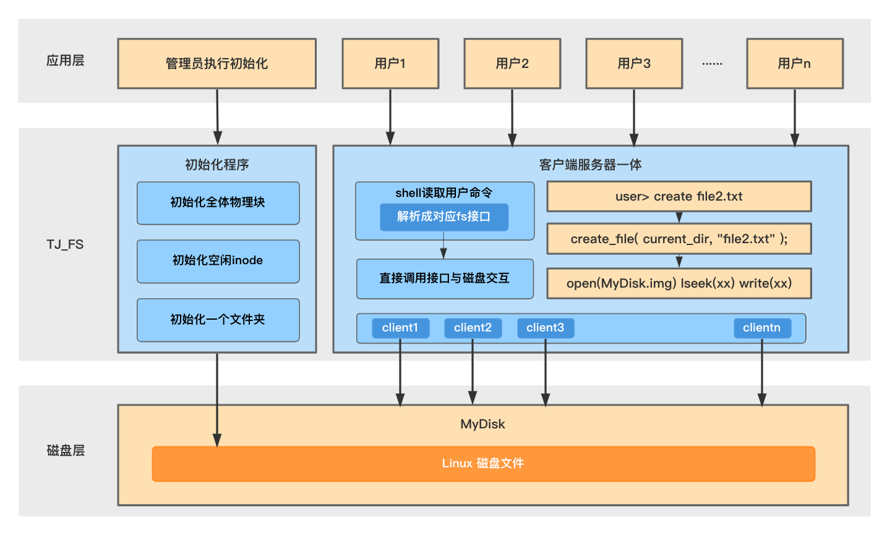

# fs_tjos
file system lab of Tongji OS course

arch:

## For NOW, there're some thing u need to change:

The myDisk.img's path was fixed at : [src/client.cpp](https://github.com/soryxie/fs_tjos/blob/master/src/client.cpp#L44) 

The outside "root_path"(test_folder) was fixed at [src/client.cpp](https://github.com/soryxie/fs_tjos/blob/master/src/client.cpp#L72)

You need to change them
